# Step-by-Step setup of dess in AWS

In this step-by-step guide I will walk you through all steps required to setup your own private dess using AWS. Please use the index to skip some steps in case you have already completed them.

## Table of contents

- [Pre-requisites](#pre-requisites)
  - [ Registering your @sign](#Registering)
    - [ Sign-up for AWS account](#sign_up)
  - [Register your own fully qualified domain name](#FQDN)
    - [Register domain name with AWS](#cloud_domain)
    - [Create Cloud DNS zone](#DNS_zone)

* [Preparing AWS instance](#prep_instance)
* [Preparing your instance for network access](#networking)
  - [Assignment of Static IP](#static_IP)
  - [Assignment of Domain name to your static IP](#domain2IP)
  - [Setting up Firewall](#firewall)
* [Instance setup and dess deployment](#deployment)
* [Registration of @sign in your private dess](#dess2@sign)
* [Activation of @sign](#activation)

## Pre-requisites <a name="pre-requisites"></a>

- Registered @sign(s) to setup
- An AWS account
- A Fully Qualified Domain Name (FQDN)

### 1. Registering your @sign <a name="Registering"></a>

This topic is already well documented. Please follow the guidance of [Our FAQs](https://atsign.com/faqs/) and register via [the registrar site](https://atsign.com/get-an-sign/).

### 2. Sign-up for AWS account <a name="sign_up"></a>

If you are new to AWS, signing up for an account is free! The cost of running dess is about 10$/month. You can create your account at https://aws.amazon.com/ and as of June 6th, 2021 there is a “free tier” available which was used during the making of this guide.


Follow the instructions on screen.

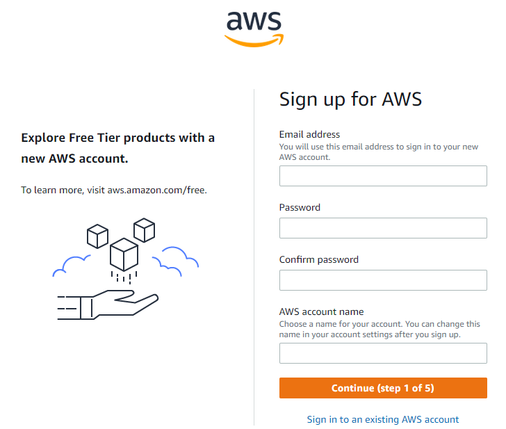

Once you are done with registration, you will be able to login to your [aws console](http://aws.amazon.com/console).

Make sure that you select the correct region in the top right corner.


Select the region that is geographically closest to your location for best performance.

You are now setup on AWS and ready to prepare dess.

### 3. Register your own fully qualified domain name (FQDN) <a name="FQDN"></a>

This step can be performed at a variety of sites, all with different pricing models. You can use sites like [Go Daddy](http://www.godaddy.com), [Namecheap](https://www.namecheap.com/), and many others. However, since we have AWS account, we can use it to register our domain through the Route 53 service.

In your AWS console navigate to services in top left corner and select `Route 53`.

#### a) Register domain name with AWS. <a name="cloud_domain"></a>

In your AWS console search for `Route 53`.


You can start looking for your domain directly from here:

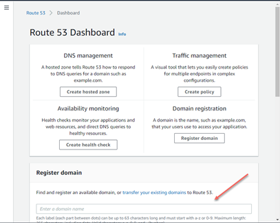

Based on the domain name you search, AWS will give you similar options, and their pricing. As I am looking for the best deal, the .link domain seems like a good option at a cost of 5$ / year.

In my case 4atsign.link is free and I will register it by clicking “Add to cart” and continue.


Fill out DNS registration form:

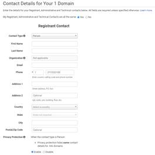

Continue review details and order. At this point if all is fine you should see your domain request pending:

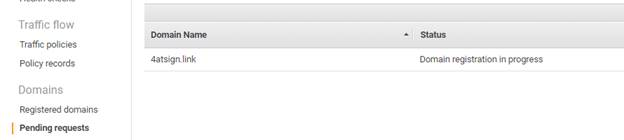

This can take some time so why don’t we move on to next step!

### 4. Preparing AWS instance <a name="prep_instance"></a>

Now since I am new to AWS, the easiest way to get started is by using the LightSail service from service catalog. This will enable you to deploy small system which is more then capable of handling dess at pre-set price.

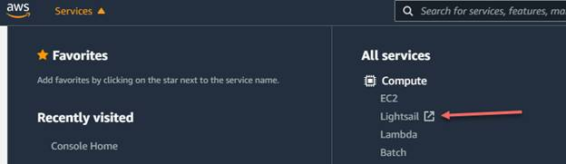

Welcome to LightSail:


First step is to create new instance. Fortunately, we have big orange button that can do just that!

There are several options we are presented at this moment. Since I am living in Europe I select “**Frankfurt, Zone A** (eu-central-1a)” as my instance location. Instance region will dictate how well will your instance response based on your geographical location. People located in India should selects APAC region where as people in US should select North America region. You can leave availability zone set as default.


Next up will be selection of operating system we want to deploy. We know that dess works well with Ubuntu 20.04 LTS so lets select just that.


You are presented with couple more options, but unless you know what you are doing leave these as is.


Now let’s select instance plan. dess is relatively light weight so for testing purposes I will select first instance plan for 3.5$/Month. This will provide us with 512 MB of RAM, 1vCPU, 20GB of storage and 1TB of data transfer. This is more then enough to run our dess.


Lastly we have to name our instance. This is the name you will be presented with in your dashboard.


Last but not least is to press “Create instance”


After a couple of seconds you should be re-routed to your dashboard and see your instance up and running:


### 5. Preparing your instance for network access <a name="networking"></a>

#### a) Assignment of Static IP <a name="static_IP"></a>

Next up, is to provide our instance with a static IP and linking our domain to it.

When you click on your instance name, it will take you to the management console, which should look like this:

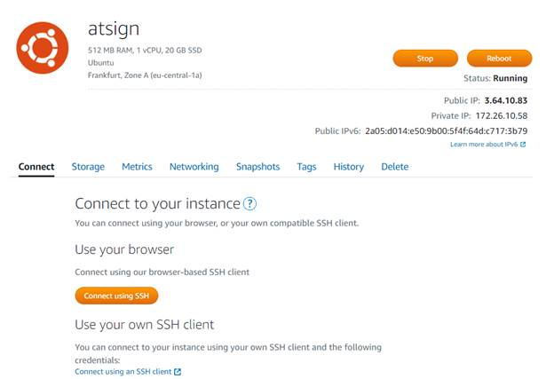

This is where you control hardware, connectivity and if needed can delete your instance.

Lets configure a static IP address for your new instance. Navigate to Networking and click on Create static IP:


Our region and instance is selected, so the only thing left is to name our static IP. I selected the name atsign-static, but it can be any name you like.


Lets hit create:


And voila, we now have a static IP address on the internet and it will not change. Now we can link our domain name with it.


When you click on your instance name and navigate to Networking, the static IP is now assigned.


#### b) Assignment of Domain name to your static IP <a name="domain2IP"></a>

We can now move on to linking our static IP address to our domain. This is done via the AWS console which can be accessed in the top right of Lightsail.


Verify your email used for registering domain:

By now you should receive verification email that will confirm registration of your domain. Click this link before moving on.

Linking domain with your static address:

Lets navigate to “Route 53” from Services menu.


From your dashboard click on “Domain” which will take you to the “Registered Domains” tab.


Here you can click on your registered domain which will take you to overview page with domain status and contacts.


Click on “Manage DNS”

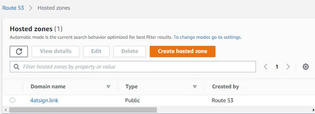

And click on your domain name.

This will show you your DNS records for your domain. We now need to link A type record to your domain linking it to IP address of your instance.

This is done simply by typing your static IP address from previous step into field “Value” and clicking Create record:


If everything goes well you should see following in your domain dashboard:


To test if you are successful open command line and ping your domain. You should see your instance static IP address. It will not respond which is normal due to IPv4 firewall. It is actually good thing!

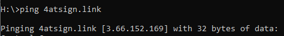

At this point we have created DNS record we will use to link our dess, we created instance name which will be running our dess and we have opened port range which is exposed to the internet and we can communicate with @sign root server and our apps with.

#### c) Setting up Firewall <a name="firewall"></a>

Next up we need to make sure we have ports open for our dess to communicate with root server and our apps. In Section networking go to section “IPv4 Firewall” and click “+ Add rule” Our rule will be “Custom” on TCP protocol with Port range in number higher then 1024. In my case I have selected port range 8000-8010. This will enable me to run up to 10 @signs in parallel.


Click create and verify that your new rule is in list:


### 6. Instance setup and dess deployment <a name="deployment"></a>

Open your [LightSail console](https://lightsail.aws.amazon.com/)

By now you should see your instance in “Running state”


Open it and on tab Connect click on “Connect using SSH”


You should be presented by a new window with command line:


Before we do anything else, we should update the system:

```
sudo apt update && sudo apt upgrade
```

This might take some time, but it will make sure we have latest repository information and the system is up to date.

Next make sure curl is installed, we will use curl to pull the dess installation file:

```
sudo apt install curl
```

Finally, run the dess installer:

```
curl -fsSL https://getdess.atsign.com | sudo bash
```

Once the installer is finished you should be prompted like so:

```
Dess installed, please move on to the sudo dess-create command.
```


### 7. Registration of @sign in your private dess <a name="dess2@sign"></a>

At this step you should already have your @sign registered at http://atsign.com. If not **go do it!**

I have registered my own free @sign (@44likelycanary) which I will link to my dess.

In your instance console, navigate to dess folder. If you were following this guide it will be located in:

We now need to create the service that will host our @sign by executing the dess-create command:

```
$ sudo dess-create @44likelycanary 4atsign.link 8000 <email address> likelycanary
```

To make it more understandable:

I will be registering my @sign **@44likelycanary**.

I will be using my domain **4atsign.link** which I have registered through AWS.

I am using port **8000** which I have opened in my instance firewall.

My registration email address is **\<email address\>** (this email is used to sign the SSL certificates).

The last **likelycanary** is the name that docker will use to track the service.

If everything is successful you should see output like this:


At this moment your @sign is registered on your dess.

## 8. Activation of @sign<a name="activation"></a>

Next up we need to activate it

Login to your dashboard at https://my.atsign.com/dashboard

Open “my @signs”

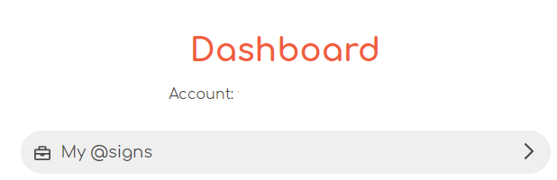

Open “managed” of @sign you are registering”


Navigate to Advance settings:


If you have already activated your @sign you will be prompted to erase all your data first

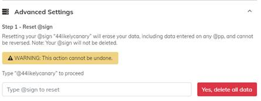

Once done you are able to link your @sign with your private dess. Use your domain and port number with which you have created service on your cloude instance and press Activate.

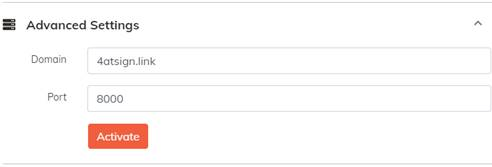

You should see that your @sign is being activated in your dashboard:


This can take several minutes so go get cup of coffee, some tea maybe, stretch your body and pray you haven’t made any mistakes!

Once the activation process completes you are welcomed by green Activated.

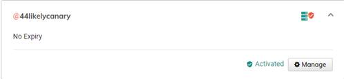

You can now open @buzz or @wavi and register your @sign via QR code and generate your keys!

**CONGRATULATIONS**
