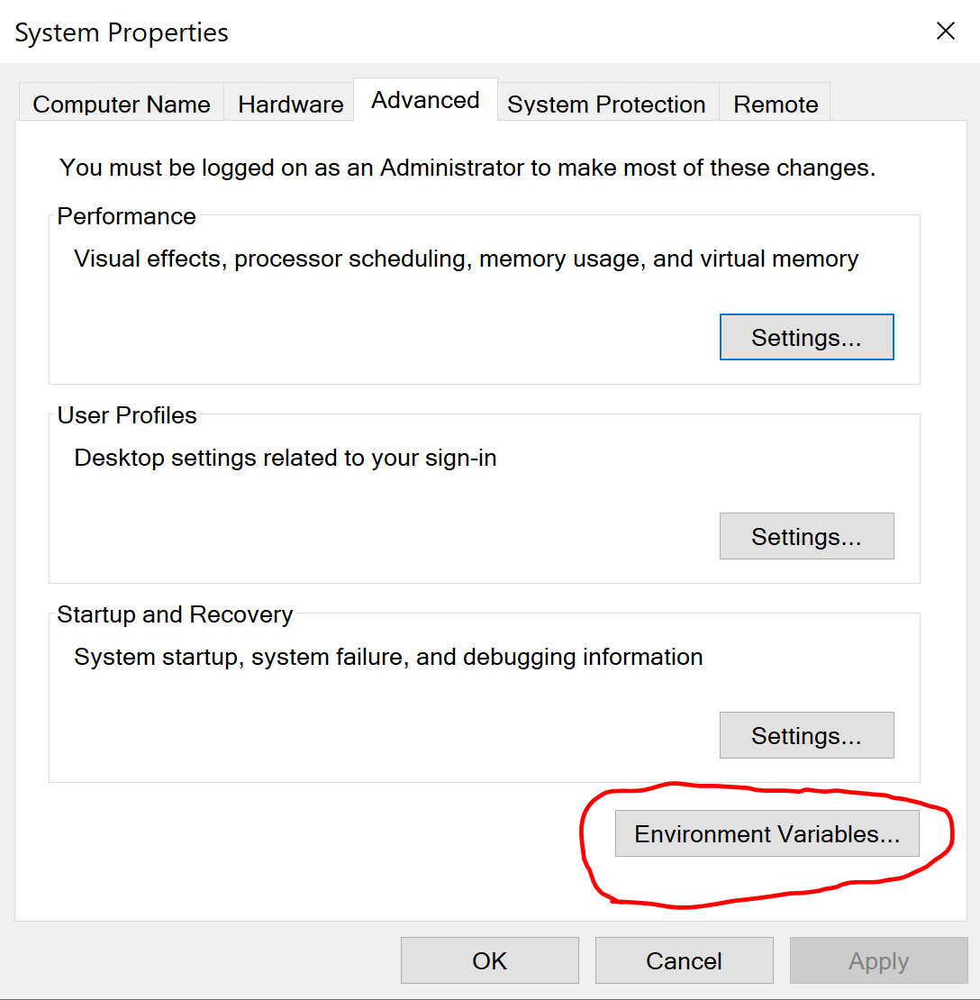

# Working With Hugo (Static Webpage Generator)
## Overview: 
Hugo, an open-source static website generator, is a new way to create web pages easily with flexible thematic capabilities. How do you get started with it and how can you go from beginner to confident?

## What is Hugo?
Hugo is a static site generator that can be seen as a competitor for WordPress and Bootstrap. The best part about Hugo that differentiates it from its competitors is that it is an open-source project, which means it’s free to use! Hugo also makes content management a headache-free, comprehensive process! Hugo can be incredible for this type of content management due to not even needing to write HTML if web development is not something you’re comfortable with! If you are the type who really enjoys getting your hands dirty, Hugo’s flexibility expands to allowing developers to completely modify everything about their own static web page. Now what’s a static web page? You can pretty much sum it up to be a hard-coded page of information that, of course, does not change dynamically. The best advantage that static web pages have over dynamic web pages is the extreme difference in speed. Because most dynamic websites are producing content for the individual visitor, it can take much longer to produce the content. 

There’s a growing community behind Hugo with numerous Stack Overflow locations with any questions relevant to that of Hugo.
Getting Started with Hugo:

## Windows:
### Installing Hugo on Windows:

There are a few ways in which you can get started with Hugo, however the easiest way I have found to getting started and jumping straight into things is by the following steps:

Create a directory in a location on your drive. For me, I have more storage capacity within my D: drive so I navigate to my D: drive within my File Explorer and simply right click and select ‘Folder’. This will create a new folder wherever you were within your drive. Next, rename this folder to ‘Hugo’. After this, navigate inside of your Hugo folder and create another folder within it, this time calling it ‘bin’. 

You’re now ready to download Hugo on to your machine. As most projects which are open-source can be found on GitHub, so can Hugo’s releases. In any web browser, navigate to the [GoHugoIo](https://github.com/gohugoio/hugo/releases "GoHugo Resources") repository. Here, you will find a great list of all of the releases catered for Windows, Linux, and MacOS. Be sure to select a release that has your operating system in the title. For example, I am using a Windows 10 machine that runs a 64 bit processor. So I navigated to the zip file titled hugo_extended_0.83.1_Windows-64bit.zip. (Note: the release number may be different from the one listed above due to the time at which I have written this document. You may also noticed that I have chosen the extended Hugo version. Hugo extended has more capabilities, especially for thematic purposes. Hugo's extension comes with a few advantages such as; SASS/SCSS support, Minify javascript and css, resource catenation, source mapping, image processing and so much more. A more in depth view of it can be found [here](https://www.npmjs.com/package/hugo-extended).

Once you have found the matching release title for your machine, feel free to simply download the zip file. Where you download the zip file does not matter, however, where you extract it does. When your download is complete, select ‘Extract all’ and be sure that you extract the contents of what you downloaded into the ‘bin’ folder that exists within your Hugo folder. Once the extraction is complete, it should look something like this:


For the release that I have downloaded and extracted, there are three files. Perhaps in a later release of Hugo, there may be more files included, but for now, as long as you have the application file titled ‘hugo’, you will be fine. If, for whatever odd reason, the ‘hugo’ file is titled something else, be sure to rename it to ‘hugo’ (note the lowercase ‘h’). There is also a license file and a readme. It is completely up to you if you read the readme and license files. 

Determining if your Installation on Windows was successful:

Apologies in advance for MacOS and Linux users as I will be demonstrating the following steps using a Windows 10 machine. A later edit with both MacOS and Linux will be created to cater those who wish to learn from a separate operating system. 
To make sure that your Hugo was successfully installed and extracted, open your command prompt [Some ways in which this can be done => (Win key + r, type ‘cmd’, hit ‘enter’), (Go to your Search bar and the bottom of your taskbar and type in ‘cmd’ or ‘command prompt’ and hit ‘enter’)] and navigate to the directory where you extracted Hugo. For the above picture, my hugo.exe file’s location was D:\Hugo\bin\hugo.exe, so all I have to type is ‘cd D:\Hugo\bin’ and I will be taken to where the hugo.exe exists. If you’re not sure where you had saved your Hugo folder, you can either use the File Explorer you have presently open and simply highlight the path that is in the bar above your currently open Hugo folder. I have circled it below for your convenience.


To show what your command prompt should look like:


Once you are here, feel free to try the command ‘hugo version’:


If your command prompt happily prints out the current version of Hugo you have on your machine, this means you have successfully installed and extracted Hugo onto your machine. However, you may notice that if you use the command ‘cd ..’ to move directories to the ‘Hugo’ folder rather than ‘bin’ and try the command ‘hugo version’ you will be hit with an error or Windows will tell you that hugo isn’t a recognized command.


If you are like me, and wish to be capable of using the hugo command anywhere on your machine, maybe because you would like to create a web page with its own folder and its own content, there is an easy way to fix this. 

What you will have to do is navigate to your ‘Search’ bar and type in ‘env’ or ‘environment’. Windows will suggest the ‘Edit the System Environment Variables’. Open it and a System Properties dialog box should appear and look something like this:


Double-click on the button labeled ‘Environment Variables’ and this will open the dialog box where you can edit the environment variables of your machine. You may be wondering what environment variables are and what they’re for. In simplest terms, just like how you noticed that your hugo command did not work outside of the bin folder, there are other applications that work the same way and will only work in the folder they exist in. Windows has the capability of allowing you to run the application from anywhere, which is exactly what we would like to do. You should see something in your ‘user variables’ called Path. Each Path that is listed, is more than likely an application, similar to your Hugo, that exists only in a folder but is used globally on your machine. Highlight ‘Path’ and click ‘Edit...’. This will open a new dialog box that will list the individual paths that already exist. Click ‘New’ and simply type (or paste) the location of your hugo.exe. If you may recall from my example, my hugo.exe was in the following location; D:\hugo_ext\bin\.

 

Here’s what mine looks like after I have finished typing in where it exists (it is the one highlighted in blue). After you have done the same, you can now click ‘OK’ until all of the dialog boxes are closed. Now this is where the magic happens! After restarting your computer, try using the ‘hugo version’ command again outside of the ‘Hugo\bin’ folder and see if Windows recognizes it as a command! I simply started up my command prompt and immediately typed in ‘hugo version’ and it worked. If the command works, you are now ready to get started on a Hugo project.

 


## Mac:
### Installing Hugo on Mac:
The first step you will want to take is navigating to the website [Homebrew](https://brew.sh "Homebrew Installation"). This website is a package manager and allows you to install, download and manage packages. You can use [Homebrew](https://brew.sh "Homebrew Installation") to install Hugo easily on your computer. Once you are taken to the landing page, you should come across a terminal command that looks like: 

```
/bin/bash -c "$(curl -fsSL https://raw.githubusercontent.com/Homebrew/install/HEAD/install.sh)"
```

// NOTE: 
// This command may be updated depending on any new releases,
// so be sure to check the website before copying the line of code above! 

Simply paste the line of code into your terminal. Once you click enter and input your password for administrative access, Homebrew will begin installing itself onto your machine. This can take a few minutes.	Once Homebrew is finished, you can then type the command:
 
```
brew install hugo
```

Homebrew may update itself automatically before installing hugo. 

### Determining if your Installation on Windows was successful:

You can validate your install by the command:

```
which hugo
```

You can also use the command: 

```
hugo version
```

If you run into an error, proceed through the Windows steps and follow the instructions up until the GitHub section where you manually install the package from the repository for your own machine. 

## Creating a Hugo project:

Depending on your operating system, open your command prompt/terminal. You can also launch an IDE of your preference and have the terminal open within it. To create a new hugo project, be sure that you are within a directory that you would want to have your Hugo project created in. For this article, I will create a new folder within my D: drive (Windows) and then use the command:

```
hugo new site your_name_here
```

Refer to the steps within my command prompt below: I first check that my hugo command works, change directory into my D: drive, create a new folder called, ‘my_hugo_site’, navigate into that folder, and then create a new Hugo site called, ‘my_hugo_project’. 

 

If you receive the ‘Congratulations!’ message, this means that you have successfully created a new Hugo site. If you expand the project folder to see its contents, you will see that a few folders have been created. (Be sure that you navigate within your newly created project first!)

 


The number of folders created here may seem a bit overwhelming, but have no fear! We will go over what each folder is for.

### Archetypes:

The first folder is the ‘archetypes’ folder. This folder is typically used by those more confident with Hugo. An archetype, in its simplest form, is simply a constant that occurs throughout all of the content of your website, something that will not change. With Hugo, you can manually create data about your site (for you Computer Scientists, that’s metadata!). What this means is that you can assign values to things that will not be changing. This could mean, who initially created the website, what date it was created, what information populates the site itself, and etc.

### Content:

A very self explanatory folder, this is where the main content of your site will exist. 

### Data:

You can almost view this as your website’s own database which can house .json files and allows you to utilize information that exists within external pieces.

### Layouts:
Just like a word document, if you wish to add information within the same location of every page that exists on your website, such as a header or a footer, this is where you would add that.

### Static:

This is, of course, where your static elements will exist. These elements may include your javascript or css files.

### config.toml:
This file contains the settings of your website, such as its URL, what language it contains, and the title of the website.

### Themes:
If graphic design isn’t one of your strengths, Hugo being an open-source project means that there are countless persons releasing their own themes and layouts for you to use! You can browse these themes [here](https://themes.gohugo.io "Hugo Themes"). Installing a theme is just as simple as downloading a folder to your machine, because that is exactly what you are doing! You may notice that every theme which peaks your interest will also exist on GitHub. You can use whatever method you prefer to retrieve the code. In this document, I will demonstrate a couple ways to do this. Once you find a theme that suits your needs or ‘aesthetic’, simply click on the theme. You may see two or three buttons, ‘Download’, ‘Demo’, ‘Homepage’. If you are confident that this is the theme you want, click ‘Download’ and it will take you to the GitHub repository where the theme exists. Click on the green ‘Code’ button and this will give you a few options on how to retrieve the code. 

 

For this example, I have found a theme that interests me titled ‘Dream’. For users who have Git, you can copy the https link and navigate into the ‘themes’ folder of your project to git clone it. Refer to the screenshot below (I am using Git Bash):

 

When you clone the repository, it will automatically create a folder for you. However, if you are not sure how to use Git, you can simply download the Zip file onto your machine. Before installing this zip folder, be sure to create a folder within your ‘themes’ folder with the appropriate title of the theme you are downloading. After downloading the zip folder, you should extract the contents into the folder that you just created inside of your ‘themes’ folder. You can see in the screenshot below, that the folder ‘hugo-theme-dream’ exists within the ‘themes’ folder. 

 

After successfully implementing the above steps, navigate into your config.toml file and add the line of code below everything else that exists in the file:

```
theme = “folder_name_here”
```

So, in my case, I would type the following:

```
theme = “hugo-theme-dream”
```

After adding this line, save the document and to make sure that you have properly called this theme into your site use the following command in your command prompt/terminal to start up your Hugo local server:

```
hugo server -D
```

The -D will launch all of the draft pages that exist within your project folder.

After this, you can now open any web browser and type in the URL:

[localhost:1313](http://localhost:1313)

You should now see your website and the theme you installed! From here, if you wish to contrbute, I recommend reading through our 'Contributing to an Open-Source Project' document!

### Steps for Setting up our hugo dev site on your machine

1. Since I have already created a fork of the atsign.dev repo, all I simply have to do is fetch the upstream for any recent changes made.

2. I then proceed to git pull the updated forked repo (or if you haven't already simply git clone it).

3. You now need to edit the config.toml file so that your theme = "at_docsy"

4. Get the https:// link from the at_docsy repo on our [GitHub](https://github.com/atsign-foundation/at_docsy.git)

5. If you are using Git Bash all you have to do is navigate within the atsign.dev folder that contains the folders; content, archetypes, assets, etc. and use the command:
```
git submodule add "https://github.com/atsign-foundation/at_docsy.git" themes/at_docsy
```

This command will pull the at_docsy repo's contents and add them to a created folder titled at_docsy under your themes folder

6. Finally, use the command below and you will be ready to use the hugo commands:
```
git submodule update --init --recursive 
```


