# Step-by-Step setup of DESS in Google Cloud Platform (GCP).

In this step-by-step guide I will walk you through all steps required to setup your own private DESS in GCP cloud from scratch. Please use index to skip some steps in case you have done them in other way.


## Table of contents

- [Pre-requisites](#pre-requisites)
    + [ Registering your @sign](#Registering)
        - [ Sign-up for GCP account](#sign_up)
        - [Account creation](#create_account)
    + [Register your own fully qualified domain name](#FQDN)
        - [Register domain name with GCP.](#cloud_domain)
        - [Create Cloud DNS zone](#DNS_zone)
+ [Preparing GCP instance](#prep_instance)
+ [Preparing your instance for network access](#networking)
    - [Assignment of Static IP](#static_IP)
    - [Assignment of Domain name to your static IP](#domain2IP)
    - [Setting up Firewall](#firewall)
+ [Instance setup and DESS deployment](#deployment)
+ [Registration of @sign in your private DESS](#DESS2@sign)
+ [Activation of @sign](#activation)


## Pre-requisites <a name="pre-requisites"></a>

- Register Atsign at http://atsign.com
- Have google account
- Have registered Fully Qualified Domain Name (FQDN)

### 1. Registering your @sign <a name="Registering"></a>

This topic is already well documents. Please follow guidance of https://atsign.com/faqs/ and register via https://atsign.com/get-an-sign/.

### 2. Sign-up for GCP account <a name="sign_up"></a>

#### a) Account creation <a name="create_account"></a>

If you are new to cloud like me and need to create new GCP account, I have good news! The creation is for free. As promotion all new customer will also receive 300$ as credit. That is more than enough to run multiple DESS’s for 3 months of offer validity.

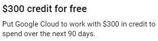

You can register with your gmail account or create new one by clicking “Get started for free” and follow instructions to register


Once done with registration you will be able to login to your https://console.cloud.google.com/
And voila you have your GCP account up and running.

#### b) Setting up billing  <a name="billing"></a>

To be able to run some services you have to maintain billing account. Navigation Menu -> Billing 


By default GCP creates “My Billing Account” which you can link to your project.


Click “Link Billing account” and select “My billing account” from drop down


&#x1F534; Its important to note that this account holds your 300$ free credits! &#x1F534;

We are all setup and ready to go deploy!


### 3. Register your own fully qualified domain name (FQDN) <a name="FQDN"></a>

This step can be performed at range of different sites with different pricing models. You can use sites like http://www.godaddy.com; https://www.namecheap.com/; and many others. Since we have GCP account we can use it to register our domain through Cloud Domain.

#### a) Register domain name with GCP. <a name="cloud_domain"></a>

In your GCP console search for `Cloud Domain`.

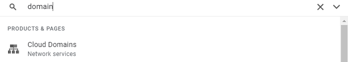

We first need to enable this service.

 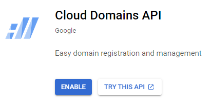


Once the service activates you will be presented with its dashboard. 

Lets register our fully qualified domain name (FQDN) that will be used for registration of our DESS.

Click on “Register Domain” and look for suitable name.


Reviewing pricing options of GCP .pw is their cheapest option which will work for testing. For my test case I am selecting atsign.pw with price $0.75 / month by clicking add to cart button and continue.

 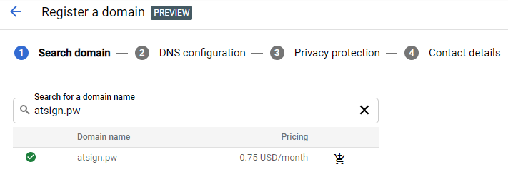

 

Next we can select where will our DNS record be hosted. Simply select “Use Google Domains” and DNSSEC “Enabled” and click continue.

 

We have no options with Privacy protection so simply click continue.

 

Fill out contact details and click register. This will trigger registration email you will have to verify.

 

Once you verify your email your domain should be ready to use

 

#### b) Create Cloud DNS zone <a name="DNS_zone"></a>

Next step is to enable Cloud DNS service. Search for DNS in search bar and select `Cloud DNS`


If its your first time activating this service you will have to enable the API. Press enable and wait for the activation to finish.

 

Lets crate new DNS zone by clicking “Create Zone”

 

We will select zone type as Public since we will be connecting to our DNS from internet and provide your registered DNS name. In my case atsign.pw. DNSSEC will be set to off and provide some meaningful Description. Once you filled all your details press create.

 

 You should receive following message:

 


### 4. Preparing GCP instance <a name="prep_instance"></a>

Now since I am new to GCP the easiest way to start using it is with prebuild solutions. This way you will deploy small system which is more then capable of handling DESS at pre-set price. 

 

We can use pre-build “Ubuntu 20”. In Search bar look for `Ubuntu20`


&#x1F534; **Make sure to use “Ubuntu 20” and not “Hardened Ubuntu 20”. Although the Hardened version will work as well it requires additional manual steps to make work.**&#x1F534; 

​                               

This will take you to this prebuild solution overview page:

 

Select launch

  

And press enable all required API’s

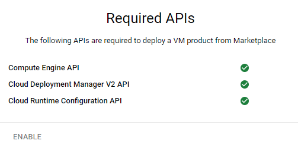

Once all API’s are activated you are taken to configuration page:

 

Prices are based on region and power of selected Virtual Machine (VM). To cost optimize you can select US region / N1 / g1-small at cost of $15/Month.

Next up is boot disk which we can leave as is.


This will deploy your Ubuntu 20.04 virtual machine.


### 5. Preparing your instance for network access <a name="networking"></a>

#### a) Assignment of Static IP <a name="static_IP"></a>

Next up our list of activities is providing our instance with static IP and linking our domain to it.

GCP assigned ephemeral IP address to our newly created VM. We need to change it to static IP. 

In search bar look for `External IP addresses`.


You should see your external IP address assigned to your VM


In column Type select ephemeral and change it to Static

 

Give your static IP name and some description.

 

Type should now say Static

  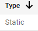

#### b) Assignment of Domain name to your static IP <a name="domain2IP"></a>

Next step is to point your domain to your virtual machine running DESS. 

Search for `Cloud DNS` 


Open zone you have created in step [3.b Create Cloud DNS zone](#DNS_zone)


We now need to link A type record to your domain linking it to IP address of your Virtual machine.

This is done simply press “Add record set”  

  

Select Resource record type “A” and IPv4 address the address of your DESS virtual machine.

  

If everything goes well you should see following in your domain dashboard:

 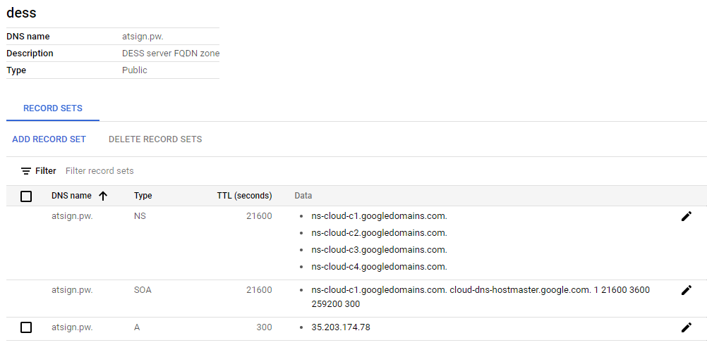

Next step is to update Google Name servers. You can follow Googles guide - step 5.

https://cloud.google.com/dns/docs/tutorials/create-domain-tutorial#register-domain

To test if you are successful open command line and ping your domain. You should see your instance static IP address. 

 

At this point we have created DNS record we will use to link our DESS, we created instance name which will be running our DESS and we have opened port range which is exposed to the internet and we can communicate with @sign root server and our apps with.

#### c) Setting up Firewall <a name="firewall"></a>

Search for Firewall in search bar.

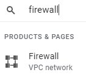

Click on Create firewall rule


Lets create firewall rule that will enable the @sign root server communicate with our DESS.

   

Important things to note:

1)   Ingress translates to incoming traffic. 

2)   Selecting IP range as `0.0.0.0/0` will allow traffic from anywhere on the internet.

3)   For my use case I will enable port range `8000 – 8010` allowing me to register up to 10 @signs.

 

Press `create` and validate that your new rule appears in list of firewall rules.


Second we need to create firewall rule that will enable your DESS server to communicate with certification authority.


Important things to note:

1)   Ingress translates to incoming traffic. 

2)   Selecting IP range as `0.0.0.0/0` will allow traffic from anywhere on the internet.

3)   You need to enable port `80` for communication with Certification authority.


Press `create` and validate that your new rule appears in list of firewall rules.

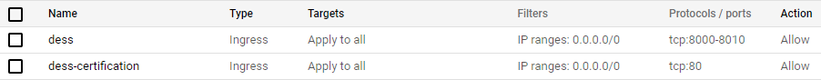

### 6. Instance setup and DESS deployment <a name="deployment"></a>

Open your GCP console at https://console.cloud.google.com/compute/instances and search for `VM instances`


 By now you should see your instance in “Running state”


Click on the SSH button and connect to your instance.

You should be presented by new window with command line:


 Before we do anything we run update:

```sudo apt update && sudo apt upgrade```

This might take some time, but it will make sure we have latest repository information and the system is up to date and secure.

Next up we need to make sure Git is installed. This can be done with following command:

```sudo apt install git```

We are now set to download latest copy of the DESS through Git. I am following guide prepared by Colin

https://github.com/atsign-foundation/dess/tree/dess.0.0.1-release.1

Run to download fresh copy of the DESS

```git clone --branch dess.0.0.1-release.1 https://github.com/atsign-foundation/dess.git```

 

Lets navigate to DESS folder that was created and run installation scripts:

 ```cd dess```

```./install_software.sh```


At the end you should be presented with message:

 

At this point we are good to go with registering our first @sign in our private DESS running in cloud with our own FQDN!


### 7.  Registration of @sign in your private DESS <a name="DESS2@sign"></a>

At this step you should already have your at sign registered at http://atsign.com. If not **go do it!**

I have registered my own free @sign` @44likelycanary` which I will link to my GCP cloud private DESS.

In your instance console navigate to DESS folder. If you were following this guide it will be located in:

```cd /home/<username>/dess``` where username is your email address without domain. In my case atsigntest


We now need to create service hosting our @sign on our DESS by executing `./create.sh` script


In my case the command will look as following:

```./create.sh @44likelycanary atsign.pw 8000 <email address> likelycanary```

To make it more understandable:

I will be registering my @sing `@44likelycanary `

I will be using my domain `atsign.pw` which I have registered through GCP

I am using port `8000` which I have opened in my instance firewall

My registration email address is `<email address>`.

The last `likelycanary` is name which will be used by docker to register my service.

If everything is successful you should see output like this:

 

At this moment your atsign is registered on your DESS. 


## 8. Activation of @sign<a name="activation"></a>

Next up we need to activate it

Login to your dashboard at https://my.atsign.com/dashboard

Open “my @signs”

 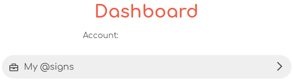

Open “managed” of @sign you are registering”

 

Navigate to Advance settings:

 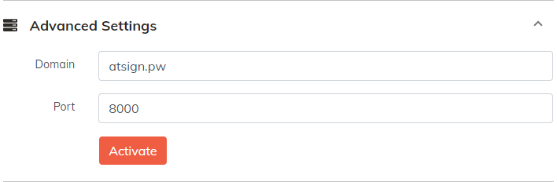

If you have already activated your @sign you will be prompted to erase all your data first

 

Once done you are able to link your @sign with your private DESS. Use your domain and port number with which you have created service on your cloud instance and press Activate

 

You should see that your @sign is being activated in your dashboard:

 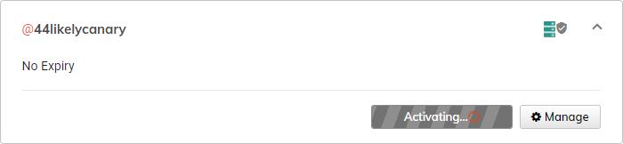

 

The activation will be completed once you have used your QR code from DESS and retrieved your keys.

Once the activation process completes you are welcomed by green Activated.

 

<u>**CONGRATULATIONS**</u>

